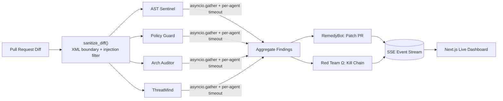

<div align="center">


[](https://www.python.org/)
[](https://fastapi.tiangolo.com/)
[](https://nextjs.org/)
[](https://www.typescriptlang.org/)
[](https://groq.com/)
[](https://aistudio.google.com/)
[](https://github.com/manojmulammagari/argus/actions/workflows/ci.yml)
[](LICENSE)
[](CONTRIBUTING.md)

### Security that thinks alongside you, not just at you.

**Six autonomous AI agents. One pull request. Zero manual triage.**

</div>

---

Security tools today throw developers a wall of alerts and walk away — no fix, no context, no sense of what actually matters. **ARGUS** takes the opposite approach: when a PR opens, six specialized AI agents scan it in parallel, cite the real historical breach your bug resembles, simulate the exact attack chain a hacker would run, and draft the fix — streaming every step of their reasoning to you live.

Named for [Argus Panoptes](https://en.wikipedia.org/wiki/Argus_Panoptes), the hundred-eyed giant of Greek myth who never fully slept — because some of his eyes were always open.

## 📖 Table of Contents

- [Quick Start](#-quick-start)
- [The 6 Autonomous Agents](#-the-6-autonomous-agents)
- [Architecture](#-architecture)
- [Security Defenses](#-security-defenses)
- [Vision & Roadmap](#-vision--roadmap)
- [Contributing](#contributing)
- [License](#license)

## 🚀 Quick Start

**Fastest path** (requires `make`):
```bash
make install
make run
```

**Manual path:**
```bash
# 1. Infrastructure (optional — the app runs fine without Postgres/Redis)
docker compose up -d
```
```bash
# 2. Backend
cd backend
pip install -r requirements-dev.txt
cp .env.example .env   # add your GROQ_API_KEY and GEMINI_API_KEY
uvicorn main_api:app --reload --host 0.0.0.0 --port 8000
```
```bash
# 3. Frontend
cd frontend
npm install
npm run dev
# Dashboard: http://localhost:3000
```

Free API keys: [Groq](https://console.groq.com/keys) · [Gemini](https://aistudio.google.com/apikey). Set `DEMO_MODE=true` in `backend/.env` to run the full flow without a real GitHub token.

## 🤖 The 6 Autonomous Agents

<details>
<summary><b>Click to expand agent breakdown</b></summary>
<br>

| Agent | Role / Capability |
| :--- | :--- |
| **AST Sentinel** | Parses the AST and scans against CWE pattern families using regex + LLM validation. |
| **Policy Guard** | Cross-references every added line against SOC2, HIPAA, and PCI-DSS compliance articles. |
| **Arch Auditor** | Analyzes architectural design flaws and exposed boundaries. |
| **ThreatMind** | Applies structured STRIDE threat modeling against all modified components. |
| **Red Team Ω** | Constructs a realistic, step-by-step attacker kill chain from the findings. |
| **RemedyBot** | Generates concrete before/after code patches to secure the PR. |

Every CWE finding is cross-referenced against real historical breaches (Equifax 2017, Capital One 2019...) with their actual regulatory fines.

</details>

## 🏗️ Architecture

<details>
<summary><b>Click to expand the full pipeline + SSE event contract</b></summary>
<br>



**SSE event contract** (`GET /api/stream/{scan_id}`):

| `type` | Payload | Meaning |
|---|---|---|
| `trace` | `{agent, text}` | An agent's live reasoning line |
| `status` | `{agent, status}` | `running` \| `complete` \| `error` |
| `finding` | `{finding: {...}}` | A new vulnerability — severity, CWE, remediation, breach citation |
| `scan_complete` | `{risk_score, attack_chain, remediation_pr_url}` | Final aggregated result |
| `timeout` / `done` | — | Stream lifecycle signals |

Full design notes: [`docs/ARCHITECTURE.md`](docs/ARCHITECTURE.md).

</details>

## 🔐 Security Defenses

<details>
<summary><b>Click to expand — ARGUS scans code for a living, so it holds itself to the same bar</b></summary>
<br>

- **Prompt-injection hardening.** Every PR diff is hard-truncated, stripped of control characters, scanned for known injection phrasing, and wrapped in `<untrusted_diff>` boundary tags before it ever reaches an LLM prompt.
- **Resilient streaming.** The SSE endpoint detects client disconnects, sends periodic heartbeats, and never terminates an active scan early.
- **Fault isolation.** Each of the 6 agents runs under an independent timeout inside `asyncio.gather` — one hung or rate-limited call can't take down the pipeline.

See [`SECURITY.md`](SECURITY.md) for our vulnerability disclosure policy.

</details>

## 🗺️ Vision & Roadmap

**Now** — parallel multi-agent scanning, live SSE dashboard, injection-hardened ingestion, automated risk scoring and kill-chain simulation.

**Next** — a real GitHub App install flow (webhook-triggered scans on every PR instead of a manual demo trigger), Redis-backed distributed agent execution for concurrent multi-repo scanning, persisted scan history.

**Later** — a VS Code extension for pre-commit scanning, custom compliance rule packs (GDPR, FedRAMP), a self-hosted mode for orgs that can't send code to third-party LLM APIs.

## Contributing

Contributions are welcome — see [`CONTRIBUTING.md`](CONTRIBUTING.md) for dev setup, branch conventions, and PR expectations.

## License

MIT — see [`LICENSE`](LICENSE).

---

<div align="center">
<sub>ARGUS never fully sleeps.</sub>
</div>